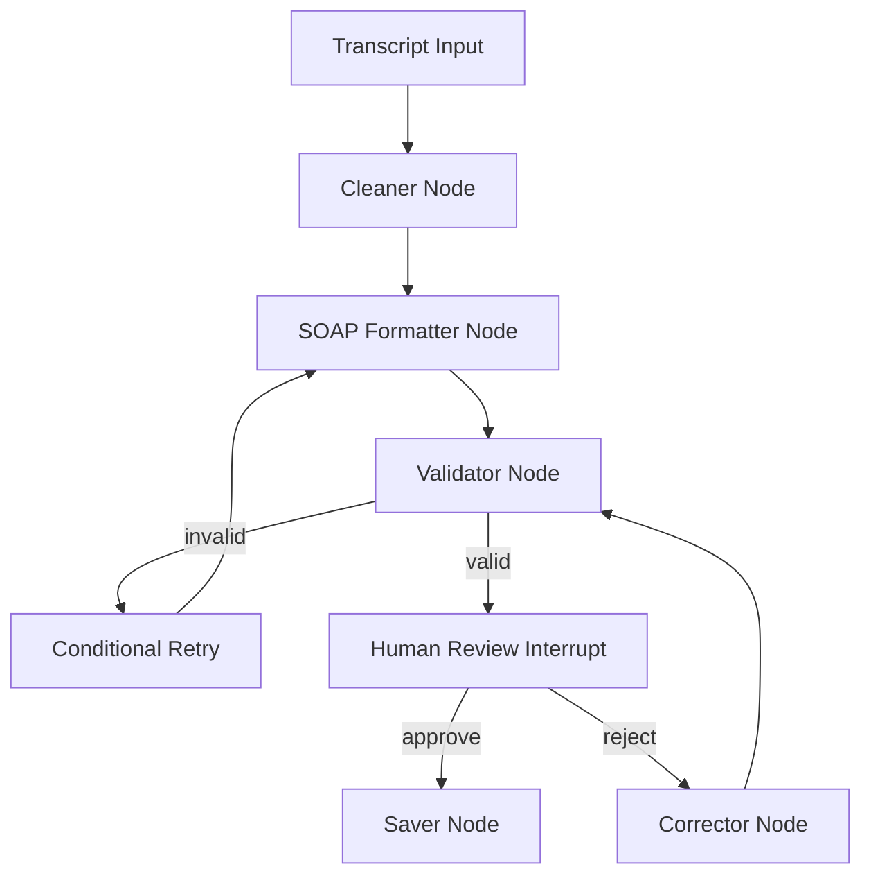
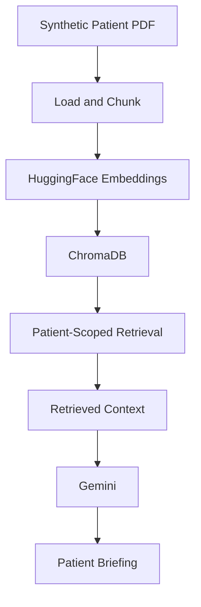

# MediFlow

An educational Agentic AI project demonstrating LangChain, LangGraph, RAG, human-in-the-loop workflows, and AI-assisted clinical documentation.

> [!WARNING]
> Educational use only. MediFlow is not intended for diagnosis, treatment, or production healthcare use.

## Project Motivation

Clinical documentation is repetitive, and patient context is often scattered across PDFs and prior notes. MediFlow shows how a small, student-level agentic system can brief on prior patient history, draft structured SOAP notes, and preserve a reviewable workflow around that output.

## What MediFlow Does

MediFlow has three main experiences:

1. Patient History Briefing: ingests synthetic patient PDFs, chunks them, embeds them locally, stores them in ChromaDB, and generates a grounded Gemini briefing for the selected patient.
2. Clinical Documentation Workflow: accepts a typed consultation transcript, cleans it, drafts SOAP sections, validates them, pauses for human review, and routes corrections back through LangGraph.
3. Hospital Intelligence Dashboard: reads persisted SQLite data and shows summary statistics plus a simple natural-language Q&A panel.

## Demo Flow

The local demo starts FastAPI and Streamlit, accepts a Gemini API key at runtime in the UI, and lets you move through patient briefing, SOAP generation, rejection/correction, approval, and dashboard review without requiring real Gemini calls in tests.

## Agentic Workflow



LangGraph is used because it makes the workflow stateful and inspectable. Nodes produce state updates, conditional edges control retry routing, and the approval interrupt lets the reviewer decide when the record is good enough to save.

## RAG Flow



The first HuggingFace model download happens on first use. After that, retrieval and briefing run locally aside from the Gemini request.

## Key Features

- Patient history RAG over synthetic PDFs.
- PDF ingestion, chunking, and metadata tagging.
- Local HuggingFace embeddings.
- ChromaDB retrieval with patient scoping.
- Gemini-based patient briefings.
- LangGraph workflow with conditional retry, interrupt, and resume.
- Human review, correction, and SQLite persistence.
- Hospital dashboard with persisted counts and trends.
- Runtime Gemini API-key entry in Streamlit.

## Tech Stack

- Python
- FastAPI
- Streamlit
- LangGraph
- LangChain
- Gemini via `langchain-google-genai`
- HuggingFace embeddings via `langchain-huggingface`
- ChromaDB
- SQLite
- Pytest

## Project Structure

Only the main paths are listed here:

- [agents](agents)
- [clinical_workflow](clinical_workflow)
- [data](data)
- [database](database)
- [rag](rag)
- [scripts](scripts)
- [structured_outputs](structured_outputs)
- [tests](tests)
- [ui](ui)

## How to Run

Tested on Python 3.13 in the repository virtual environment.

```powershell
python -m venv .venv
.\.venv\Scripts\Activate.ps1
pip install -r requirements.txt
```

Start the backend:

```powershell
.\.venv\Scripts\python app.py
```

Start the frontend in another terminal:

```powershell
.\.venv\Scripts\python -m streamlit run ui/app.py
```

In the Streamlit UI, enter your Gemini API key in the runtime key field. The key is kept in session state and sent as `X-Gemini-API-Key` on each request.

On first run, the embedding model may download automatically. That is expected.

## Tests

Run the offline suite with:

```powershell
python -m pytest -v -m "not integration"
```

The current tracked suite contains 13 non-integration tests.

## What I Learned

- How LangGraph state moves through nodes and conditional edges.
- How retry loops and interrupts model a human review workflow.
- How to combine RAG, embeddings, and vector retrieval for patient-specific context.
- How to separate structured output extraction from the workflow nodes.
- How to connect a backend API, UI, and SQLite persistence without making tests depend on live external services.

## Limitations

- Educational project only.
- Synthetic data only.
- Gemini requires an API key and internet access.
- The embedding model may download on first use.
- Not clinically validated.
- Not intended for diagnosis or treatment.

## Disclaimer

Educational use only.
