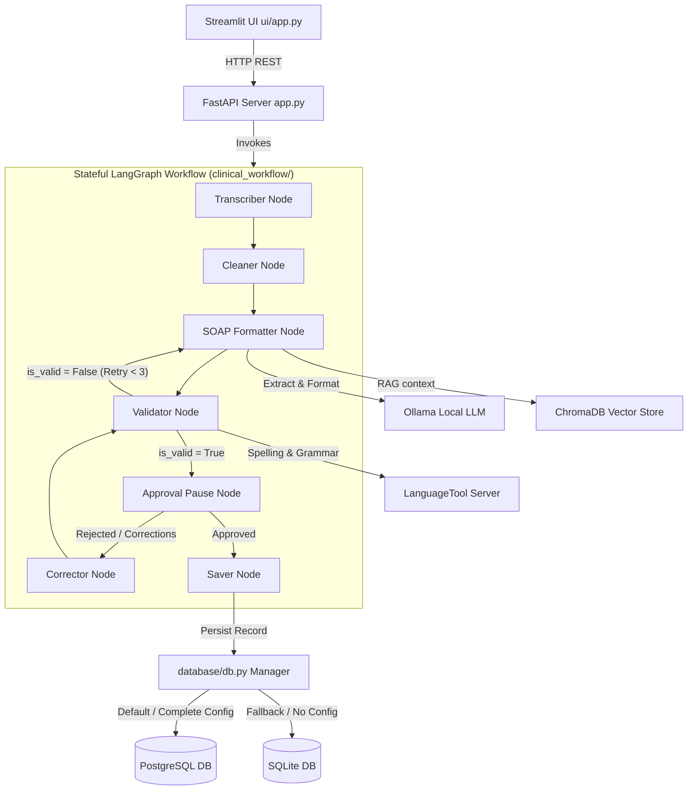

# MediFlow: AI-Powered Clinical Intelligence Platform

An educational software engineering and applied AI project demonstrating stateful medical note-taking workflows, offline local LLM integration, and clinical data persistence.

> [!WARNING]
> **Disclaimer**: MediFlow is an educational software engineering and applied AI project. It is not intended for clinical diagnosis, treatment decisions, or production healthcare use. It has not undergone clinical validation, HIPAA security audits, or medical regulatory reviews.

---

## The Problem
Physicians spend up to 40% of their workday on clinical documentation and paperwork, contributing to record-high burnout rates. Meanwhile, care coordination suffers due to fragmented patient history records and manual operational tracking. 

MediFlow solves this by providing:
1. **Contextual History Briefing**: Aggregating patient background data using Retrieval-Augmented Generation (RAG).
2. **Stateful Documentation Workflow**: Generating validated, formatted SOAP notes using local LLMs.
3. **Operational Telemetry**: Aggregating conditions and medications in a central operational dashboard.

---

## Core Modules

### 1. Patient History Summarizer
* Ingests medical PDF records and parses clinical text.
* Generates vector embeddings stored in a local **ChromaDB** index.
* Executes semantic searches with metadata filters (medications, allergies, chronic conditions) to provide structured histories before consultation.

### 2. Clinical Documentation Workflow
* Cleans transcript transcripts by stripping filler text ("um", "uh", "like").
* Auto-formats transcripts into standard **SOAP** note sections (Subjective, Objective, Assessment, Plan).
* Validates notes for completeness and validates spelling/grammar against a local **LanguageTool** instance.
* Pauses for human-in-the-loop validation (doctor approval) and loops back for corrections if rejected.

### 3. Hospital Intelligence Dashboard
* Summarizes telemetry analytics, including patient counts, total sessions, and aggregate conditions/medications.
* Provides a natural language interface to query operational statistics.

---

## System Architecture



---

## Key Engineering Decisions

* **Local-First Privacy**: Uses offline Ollama LLMs and ChromaDB to protect patient confidentiality and avoid third-party API exposure.
* **PostgreSQL with SQLite Fallback**: Supports enterprise-ready PostgreSQL persistence, but defaults to zero-config SQLite if PostgreSQL environment variables are omitted, enabling instant local runs.
* **Graceful API Degradation**: Isolates secondary LanguageTool check connections. If the LanguageTool service goes offline or times out, the workflow logs the status and completes successfully without crashing.
* **Stateful Interrupts**: Uses LangGraph's checkpointer to pause execution at the approval node, allowing doctors to review drafts in the Streamlit UI before saving.

---

## Repository Structure

```text
MediFlow/
├── agents/             # Telemetry routing and dashboard query handlers
├── clinical_workflow/  # LangGraph state schema, client nodes, and validation
│   ├── nodes/          # Graph execution steps (cleaner, saver, validator, etc.)
│   ├── languagetool.py # LanguageTool HTTP client and data models
│   └── state.py        # LangGraph state schema definitions
├── data/               # Seed scripts and sample patient PDF files for testing
├── database/           # Relational schema setup and PostgreSQL/SQLite abstraction
├── db/                 # ChromaDB indexing and vector query wrappers
├── docs/               # Technical designs, interview guides, and demo scripts
├── rag/                # Ingestion, document parsing, and retriever modules
├── tests/              # Automated unit and integration test suite
├── ui/                 # Streamlit frontend application files
├── app.py              # FastAPI server entry point
├── config.py           # Configuration loading and variable validation
├── docker-compose.yml  # Local developer Docker orchestration setup
└── requirements.txt    # Python package dependencies list
```

---

## Environment Variables

Copy `.env.example` to `.env` to customize settings:

| Variable | Description | Default |
| :--- | :--- | :--- |
| `MEDIFLOW_POSTGRES_HOST` | PostgreSQL Host Address | `localhost` |
| `MEDIFLOW_POSTGRES_DB` | PostgreSQL Database Name | `mediflow` |
| `MEDIFLOW_POSTGRES_USER` | PostgreSQL Username | `mediflow_user` |
| `MEDIFLOW_POSTGRES_PASSWORD`| PostgreSQL Password | `mediflow_password` |
| `MEDIFLOW_POSTGRES_HOST_PORT`| PostgreSQL Host Port (Docker) | `5432` |
| `MEDIFLOW_LANGUAGETOOL_URL` | LanguageTool Endpoint | `http://localhost:8010/v2/check` |
| `MEDIFLOW_LANGUAGETOOL_TIMEOUT_SECONDS` | LanguageTool Timeout | `5.0` |
| `MEDIFLOW_LLM_MODEL` | Ollama model for SOAP formatting | `llama3.2:1b` |
| `MEDIFLOW_EMBEDDING_MODEL` | Ollama embedding model for RAG | `nomic-embed-text` |

---

## Quick Start (Docker Compose)

> [!NOTE]
> **Static Validation**: The Docker Compose service configuration and Dockerfiles have been statically verified for correct ports, hostname routing, and non-root user permissions, but complete runtime composition has not yet been executed on the current host. These commands are provided as setup instructions.

Ensure Docker is running, then execute:

```bash
# Copy settings template
cp .env.example .env

# Build and start services
docker compose up --build -d
```

Access the systems:
* **Streamlit UI**: `http://localhost:8501`
* **FastAPI Docs**: `http://localhost:8000/docs`

---

## Local Development (Without Docker)

### 1. Pre-requisites
* Python 3.11+
* Ollama installed locally

### 2. Install Dependencies
```bash
pip install -r requirements.txt
```

### 3. Fetch Local Models
```bash
ollama serve
ollama pull llama3.2:1b
ollama pull nomic-embed-text
```

### 4. Run Services
Start the FastAPI server:
```bash
python app.py
```

In another terminal, start the Streamlit UI:
```bash
streamlit run ui/app.py
```

---

## Running Tests

Automated tests are divided into unit and integration suites. By default, running plain `pytest` excludes integration tests.

### Run Unit Tests (Offline / Fast)
Unit tests mock all LLM and grammar network connections:
```bash
pytest -v -m unit
```

### Run Integration Tests (Requires Active Docker Services)
To run integration tests, you must explicitly opt-in by setting the integration-test flag in your environment (which targets active running containers):
```bash
# Set flag and run integration tests
$env:MEDIFLOW_RUN_INTEGRATION_TESTS="1"; pytest -v -m integration
```

---

## Limitations & Future Work
* **No Database Migrations**: Programs schema dynamically on startup. Integration of Alembic is planned.
* **No User Authentication**: Access controls are currently omitted.
* **Local Model Quality**: Summary accuracy depends on the local model choice (e.g. `llama3.2:1b`).
