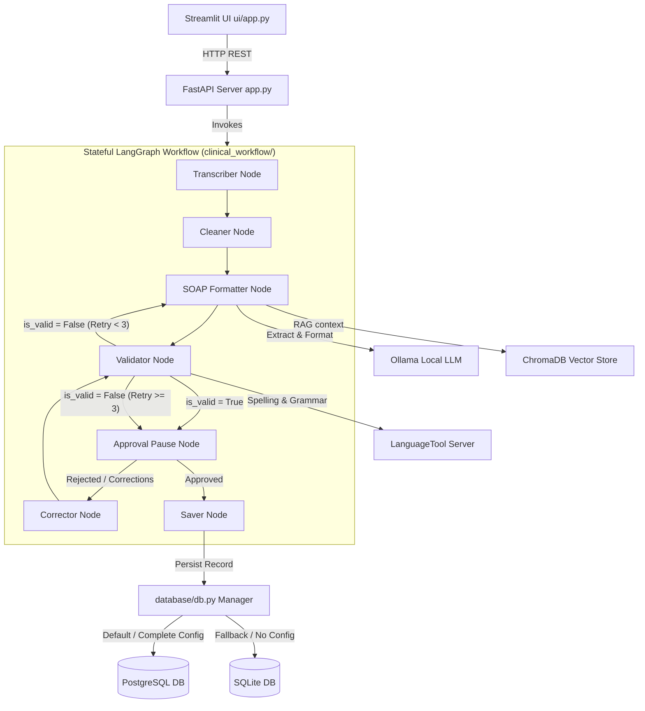

# MediFlow Application Architecture

This document describes the architectural layers and data flows of the MediFlow clinical intelligence system.

## System Topology

## Architectural Decoupling

1. **Stateful Graph Pipeline**: The LangGraph engine isolates step-by-step documentation generation (transcription cleanup, clinical data extraction, formatting, completion validation, correction, and persistence) from route handlers and the presentation interface. State changes flow sequentially and support recursive loopbacks.
2. **Unified Database Manager**: [database/db.py](file:///d:/Projects/MediFlow/database/db.py) handles connection pools, parameter replacement (`?` -> `%s` for Postgres), and transaction controls. Other services query raw SQL or schema creations without knowing if the storage backend is SQLite or PostgreSQL.
3. **Language quality isolation**: LanguageTool performs spelling/grammar recommendations only. It does not validate medical accuracy, and its connection timeouts/failures degrade gracefully to prevent workflow blockages.
