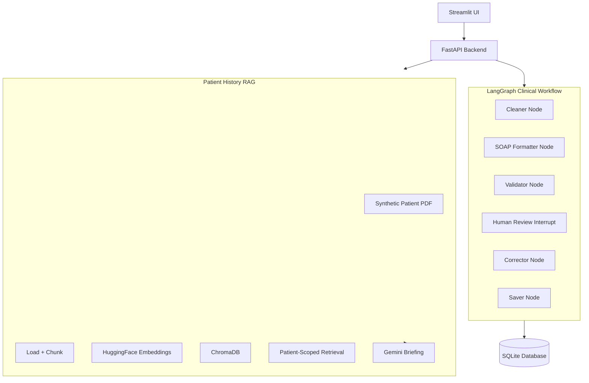

# MediFlow Architecture

This is the current v1 architecture for the release branch.

## System Topology

## Data Flow

1. The Streamlit UI collects a Gemini API key at runtime and sends it in `X-Gemini-API-Key` headers.
2. The FastAPI backend routes the request into LangGraph for SOAP generation or into the RAG service for patient briefing.
3. The workflow cleans the transcript, generates SOAP sections, validates them, and pauses for human review before saving.
4. Rejection routes the state to the corrector node, which sends the note back through validation and review.
5. Approved notes are persisted to SQLite.
6. The dashboard reads persisted SQLite data to show aggregate patient and consultation statistics.

## Notes

- RAG uses synthetic patient PDFs stored in the repository.
- Embeddings are created locally with HuggingFace and stored in ChromaDB.
- The first embedding-model download may happen on first use.
- The project intentionally avoids PostgreSQL, Docker, Ollama chat runtime, and LanguageTool in the v1 release branch.
